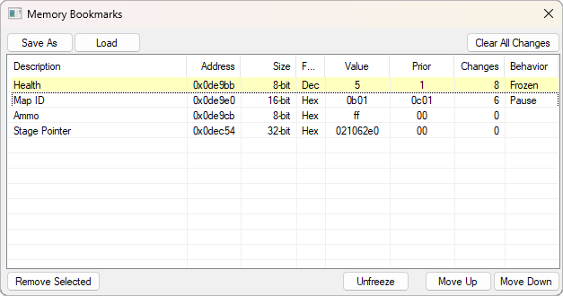
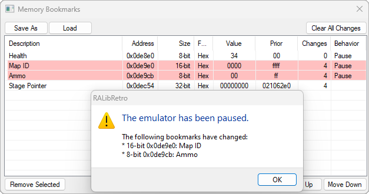

## Memory Bookmarks
### The Basics
The Memory Bookmarks window is made visible from the RA Integration menu `RetroAchievements > Memory Bookmarks`. It allows you to list and control addresses of interest and is useful through all parts of RAM digging, achievement development and resolving issues.

To add an address to the Memory Bookmarks you can press the `Add Bookmark` button on the memory inspector or `Bookmark Selected` button on the `Code Notes` window.

When adding a new address to the Memory Bookmarks, the description will be populated from the Code Notes. You are able to change this description by typing in the Description field and it will not affect the code notes.

You can sort the Memory Bookmarks manually by clicking an address and using the `Move Up` / `Move Down` buttons, or automatically by clicking the column headers

### Data Fields

| Field                 | Notes                                                                  |
| --------------------- | ---------------------------------------------------------------------- |
| Description           | Loaded from the Code Notes but can be changed                          |
| Address               | The memory address                                                     |
| Size                  | The [Memory Size](../resources/memory-sizes-diagram.md) of the address |
| Format                | The displayed format of Value and Prior. Can be Hex or Dec             |
| Value                 | The current value of the memory address                                |
| Prior                 | The value the Memory Address held before it's current value            |
| Changes               | The number of times the value has changed since reset                  |
| [Behavior](#Behavior) | How the emulator should respond to changes in the Value                |

### Behavior
The Behavior field allows you to specify what the emulator should do when a value changes. By default this field is blank however, it can be set to one of the following:

| Behavior        | Effect                                                     |
| --------------- | ---------------------------------------------------------- |
| Blank           | The emulator will behave as normal when the value changes  |
| Frozen          | The emulator keep the memory address at it's current value |
| [Pause](#Pause) | Upon change, the emulator will be paused                   |
##### Pause
To help understand when a memory address changes, you can set the bookmark behavior to `Pause`. When one or more of these addresses changes the following will happen:
- RA Integration will display an alert box listing `Pause` the bookmarks that have changed
- The Memory Bookmarks window will highlight in red all of the `Pause` bookmarks that have changed
- The emulator will be put into a Pause state. See: [Emulator Hotkeys](../resources/emulator-hotkeys.md)

After pressing OK on the alert box, the red Memory Bookmarks will remain highlighted until the emulator is no longer Paused.

### Useful Tips
- To jump to an address in the `Memory Editor` you can double click the value in the `Address` column
- You can bookmark the same address multiple times, this allows you to set different `Size` or `Format` fields.
- The `Changes` field is useful for discovering how often an address changes, you can reset all of the counters by pressing `Clear All Changes`
- When using the `Float` format, the value will be displayed as a decimal number
- If you want to change the behavior of multiple addresses at once, you can highlight them, hold `Ctrl` and click the Behavior field of the last one selected